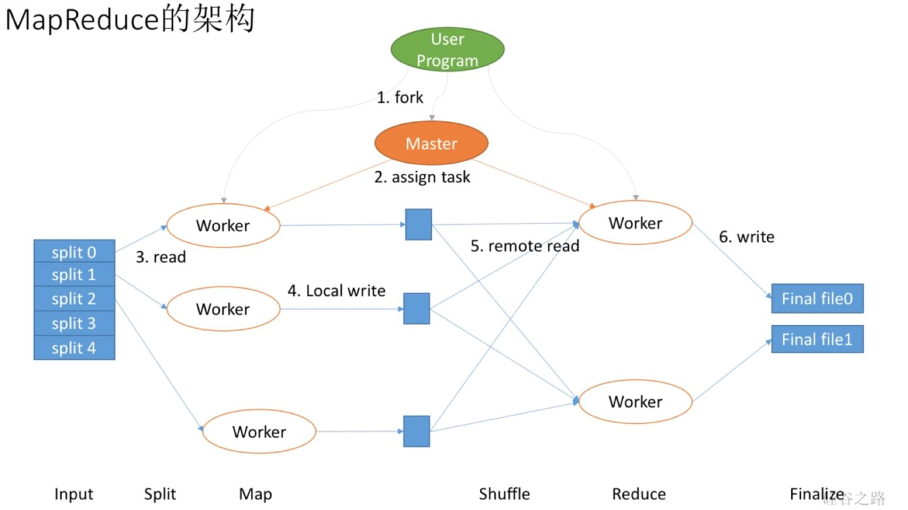

# VLDB Summer School 2021 Course

MapReduce主要有六个过程：Input, Split, Map, Shuffle, Reduce, Finalize

首先，我们有用户进程，它需要协调或者定义我们程序怎么运行，当然它不是自己运行，实际上它会先想数据有多少，需要拆解成多少个Mapper，多少个Reducer去做。比如要找5个Mapper去做，就会把数据拆成5份，这样会产生出很多很多Worker，会有Map Worker和Reduce Worker。但最重要的是还会产生一个Master Worker，这个和其他Worker等级是一样的，只不过会做一些特殊事情，它会作为用户的代理来协调整个过程，用户就可以做其他事情。Master Worker会让这个Worker去拿0号数据，一个Worker负责拿1号数据等等，这就是分配数据的过程。每个Worker会在本地把数据切分开吧，写到本地的缓存或者硬盘上行。前面Map Worker做完了，Master让Reduce Worker去拿数据，他们就会从各个Worker里拿到本地需要的数据，在本地做完Reduce以后将结果写到最终的文件里就是Finalize。实际上，这个过程可以看到第一步切数据是Input，第二步是Map拿数据Split，第三步自己切分就是Map，第四步Reduce去拿数据是Shuffle，第五步Reducer自己去做数据的整合是Reduce，第六步输出结果Finalize。

参考文献：https://zhuanlan.zhihu.com/p/32172999